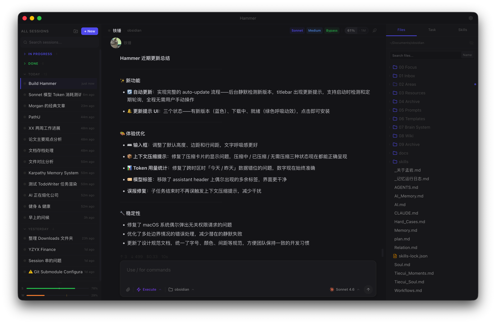
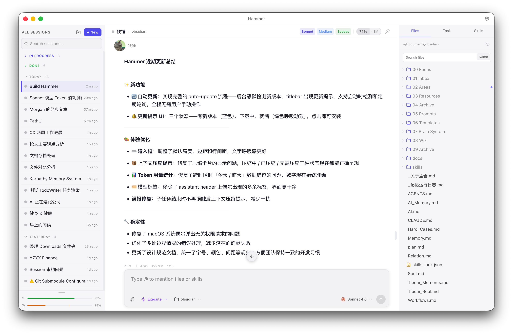

# Hammer

Claude Code 的桌面客户端。不用终端，不用命令行，打开就能用。

**[下载 Hammer for macOS →](https://github.com/dreamwords/hammer-releases/releases/latest)**

> 目前仅支持 Apple Silicon（M1 及以上）

[English](README_EN.md) | 中文

---

<p align="center">
  
  
</p>

---

## 为什么需要 Hammer

Claude Code 能帮你写代码、读写文件、执行任务，但它原本只能在终端里用，一个黑框，纯文字，会话结束就没了。

Hammer 把这一切包进了一个真正的桌面应用：多个对话窗口、持久化历史、实时可见的任务过程、文件树、用量统计……你只管和 Claude 说话，其他都在界面里。

---

## 主要功能

- **多会话，随意分组**
  同时开着十几个对话也不乱。按项目、按日期、按任何你喜欢的方式建分组，每个分组可以标不同颜色，会话可以自由拖拽排序。每个对话的历史永久保存，随时继续。

- **每个对话选自己的模型**
  同一个 app 里，这个对话用 Opus 做复杂推理，那个对话用 Sonnet 快速迭代——模型选择独立到每个会话，随时可以换。

- **任务过程完全透明**
  Claude 读了哪个文件、改了什么、运行了什么命令——每一步都展示在对话里，不是黑盒。右侧的 Tasks 面板还会聚合整个对话的工具调用、修改过的文件和当前任务进度，一眼看清 Claude 在做什么。

- **文件树就在旁边**
  左侧可以随时打开项目文件树，带 Git 修改状态标记。点开文件直接预览，选中一段文字一键引用进对话。也支持直接往输入框里拖文件或粘贴图片。

- **看见 Claude 的思维过程**
  开启 Extended Thinking 后，Claude 的推理过程实时呈现，不只是给你一个结论。可以调整思维的深度，五档可选。

- **用量和费用一目了然**
  每一轮对话底部显示 token 数和美元成本，总用量按今天、昨天、本月分开统计。不用等账单来才知道花了多少。

- **对话标注，导出 Obsidian**
  觉得某段回答有价值？选中，加标注，加注释。整个对话的标注可以一键导出到你的 Obsidian vault。

- **给对话另一端的人起个名字**
  你可以给自己起名字，也可以给 AI 起名字、换头像。当对话的两端都有了具体的名字和面孔，交流的感觉会不一样——不再是对着一个工具发指令，更像是在和一个固定的搭档协作。

- **自动更新**，退出时静默安装，不打扰使用。

---

## 开始使用

需要先安装 Claude Code CLI 并完成授权，不确定怎么做的话，可以直接问 Claude。

之后：

1. [下载最新版 .dmg](https://github.com/dreamwords/hammer-releases/releases/latest)
2. 打开 .dmg，把 Hammer 拖到「应用程序」
3. 打开 Hammer，选好工作目录，开始对话

> [!IMPORTANT]
> 当前版本尚未签名，macOS 可能会提示「应用已损坏，无法打开」。遇到这种情况，请打开终端，运行以下命令，然后重新打开 Hammer：
> ```
> xattr -cr /Applications/Hammer.app
> ```

---

## 关于

由孟岩和小主开发，自用觉得好用，希望你也喜欢。

问题反馈欢迎开 [Issue](https://github.com/dreamwords/hammer-releases/issues)。
